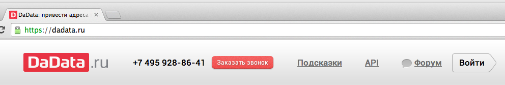
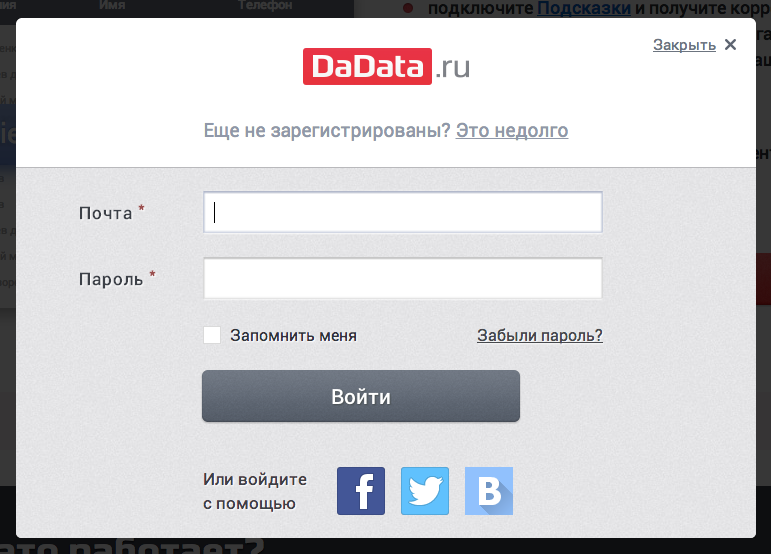
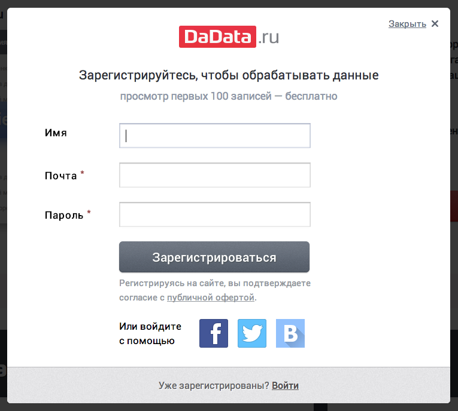

Модуль подсказок для CMS 1C Bitrix
==================================
Выводим подсказки по ФИО и почтовому адресу, автоматически определяем индекс на странице заказа в Битрикс при помощи сервиса "Подсказки" [DaData.ru] (https://dadata.ru).

Модуль работает с компонентом Современный интернет-магазин (bitrix.eshop), входящим в редакцию Битрикс "Малый Бизнес" и выше.

Требуемая версия Битрикс: 14.0 и выше.

По отзывам интернет-магазинов, модуль значительно повышает качество получаемых от пользователей данных. Клиенты начинают указывать почтовые адреса для доставки, разбитые по КЛАДР, без опечаток и с квартирами, индекс определяется автоматически. ФИО вводят без опечаток и с полом.

Установка из MarketPlace
------------------------
В скором времени мы опубликуем наш модуль на Marketplace, и вы сможете установить его оттуда.

Установка из репозитория
------------------------

Для установки модуля из репозитория необходимо: 
* Клонировать содержимое с помощью git либо скачать слепок репозитория [отсюда] (https://github.com/hflabs/suggestions-bitrix/archive/master.zip).
* Распаковать содержимое.
* Скопировать папку dadata.suggestions в директорию bitrix/modules/ на сервере (пример ниже).
 
        [root@localhost ~]# git clone https://github.com/hflabs/suggestions-bitrix.git
        Initialized empty Git repository in /root/suggestions-bitrix/.git/
        remote: Counting objects: 26, done.
        remote: Compressing objects: 100% (18/18), done.
        remote: Total 26 (delta 1), reused 23 (delta 1)
        Unpacking objects: 100% (26/26), done.
        [root@localhost ~]# cp -r suggestions-bitrix/dadata.suggestions /home/bitrix/www/bitrix/modules/
        [root@localhost ~]# chown -R bitrix.bitrix /home/bitrix/www/bitrix/modules/dadata.suggestions
* Зайти в административную консоль: Вкладка "Администрирование" -> "Marketplace" -> "Установленные решения".
* В списке решений должен появиться модуль "Подсказки DaData.ru", для подключения модуля необходимо нажать на знак ≡ , в контекстном меню выбрать пункт "установить".

* После удачного завершения установки вы увидите следующий экран

Настройка модуля
----------------
* Необходимо перейти в настройки модуля по следующему пути "Настройки" -> "Настройки продукта" -> "Настройки модулей" -> "Подсказки DaData.ru"

* В поле "API Ключ" необходимо ввести ключ, который можно получить в личном кабинете DaData.ru (ниже приведена подробная инструкция, как это сделать)
* Далее идет список типов плательщиков и список свойств заказа для каждого. Пример назначений для стандартных свойств показан на скриншоте выше.
* Стоит отметить, что для полей типа LOCATION модуль назначает значение автоматически, это сделано для того чтобы избежать конфликтов между стандартным модулем заполнения и модулем подсказок.
* После того как все необходимые настройки сделаны сохраните изменения нажав соответствующую кнопку внизу формы
* Также мы рекомендуем перенести поля индекс и местоположение вниз формы (увеличить значение свойства "Сортировка" в настройках свойств заказа, т.к. эти поля будут автоматически заполнены из полного адреса. (иначе пользователи скорее всего будут сначала пытаться заполнить индекс и местоположение самостоятельно, а потом только адрес)

Получение API токена DaData
---------------------------
Для этого нужно перейти на сайт [DaData] (https://dadata.ru)

Нажать кнопку "Войти".

В случае, если у вас уже есть учетная запись, необходимо ввести данные в форме, либо войти через учетную запись любой из предложенных социальных сетей.
В случае, если вы хотите зарегистрироваться с помощью e-mail адреса перейдите по ссылке "Это недолго" в верхней части формы и заполните предлагаемые поля.

Далее в правом-верхнем углу необходимо нажать кнопку профиля и выбрать пункт "Настройки"

В появившейся форме нажать на ссылку сгенерировать.

Полученный токен необходимо скопировать.

Использование
-------------
После включения модуля при вводе данных в поля, назначенные в настройках подсказки дополняют информацию в этих полях. При этом в случае, если возможно получить дополнительные данные (юр. адрес, ИНН, КПП для юридических лиц или индекс, местоположение для адресов) - система их обновит в соответствующих полях. 
Пример работы системы можно увидеть в разделе скриншоты настоящего руководства.

История изменений
-----------------
* 1.0.0 - Первая версия

Скриншоты
---------

