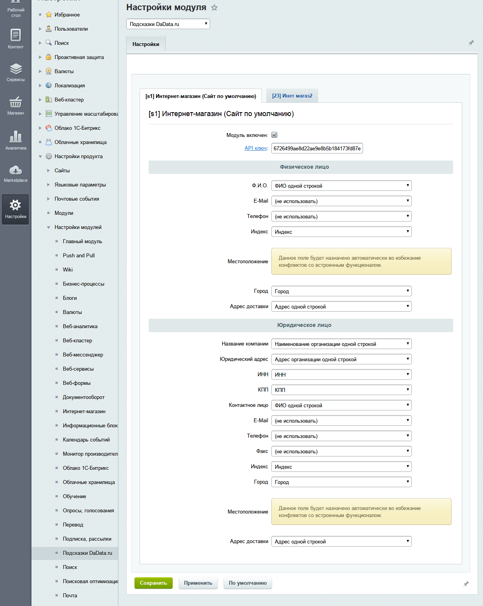

Подсказки для CMS 1C Bitrix
===========================
Версия Битрикс: 14.0 и выше.

На странице заказа в Битрикс:
- подсказываем почтовые адреса, ФИО и компании при вводе;
- автоматически заполняем индекс и местоположение для введенного адреса.

Используем сервис "Подсказки" [DaData.ru] (https://dadata.ru).

Работаем с компонентом современный интернет-магазин (bitrix.eshop), входящим в редакцию Битрикс "Малый Бизнес" и выше.

По [отзывам интернет-магазинов] (https://dadata.ru/#reviews-all), Подсказки значительно повышают качество получаемых от пользователей данных. Клиенты начинают указывать почтовые адреса для доставки, разбитые по КЛАДР, без опечаток и с квартирами, индекс определяется автоматически. ФИО вводят без опечаток и с полом.

Скриншоты
---------

Установка из MarketPlace
------------------------
В скором времени мы опубликуем наш модуль на Marketplace, и вы сможете установить его оттуда.

Установка из репозитория
------------------------

Для установки модуля из репозитория необходимо: 
* Клонировать содержимое с помощью git либо скачать слепок репозитория [отсюда] (https://github.com/hflabs/suggestions-bitrix/archive/master.zip).
* Распаковать.
* Скопировать папку dadata.suggestions в директорию bitrix/modules/ на сервере (пример ниже).

        [root@localhost ~]# git clone https://github.com/hflabs/suggestions-bitrix.git
        Initialized empty Git repository in /root/suggestions-bitrix/.git/
        remote: Counting objects: 26, done.
        remote: Compressing objects: 100% (18/18), done.
        remote: Total 26 (delta 1), reused 23 (delta 1)
        Unpacking objects: 100% (26/26), done.
        [root@localhost ~]# cp -r suggestions-bitrix/dadata.suggestions /home/bitrix/www/bitrix/modules/
        [root@localhost ~]# chown -R bitrix.bitrix /home/bitrix/www/bitrix/modules/dadata.suggestions
* Зайти в административную консоль: Вкладка "Администрирование" -> "Marketplace" -> "Установленные решения".
* В списке решений должен появиться модуль "Подсказки DaData.ru", для подключения модуля необходимо нажать на знак ≡ , в контекстном меню выбрать пункт "установить".

* После удачного завершения установки вы увидите следующий экран

Настройка модуля
----------------
* Перейдите в настройки модуля: "Настройки" -> "Настройки продукта" -> "Настройки модулей" -> "Подсказки DaData.ru"

* В поле "API Ключ" введите ключ, полученный у DaData.ru (см. инструкцию ниже).
* Выберите для свойств заказа, в которых необходимо включить подсказки, соответствующий тип подсказок из выпадающих списков. 

* Рекомендуем настройку:

 * **"Ф.И.О."**: выбрать тип подсказок **"ФИО одной строкой"**. Подсказки будут советовать фамилию, имя и отчество при вводе ФИО и автоматически заполнят поля фамилия, имя, отчество.
 
 * **"Индекс"**: выбрать тип **"Индекс"**. Подсказки запишут в это поле почтовый индекс адреса доставки. 
 
 * **"Местоположение"** и **"Индекс"** будут заполняться автоматически, поэтому рекомендуем перенести их вниз формы. Для этого увеличьте свойство *"Сортировка"* в настройках свойств заказа.
 
 * **"Город"**: выбрать тип **"Город"**. Подсказки запишут в это поле город адреса доставки. 
 
 * **"Адрес доставки"**: выбрать тип **"Адрес одной строкой"**. Подсказки будут советовать адрес при вводе адреса доставки и автоматически заполнят **"Местоположение"** и **"Индекс"**, а так же другие компоненты адреса если они будут назначены. 
 
 * **"Название компании"**: выбрать тип **"Наименование организации одной строкой"**. Подсказки будут советовать название компании при вводе и автоматически заполнят поля с типами **ИНН**, **КПП** и другие (см. полный список полей ниже). 

* Сохраните изменения.

* Типы полей которые можно назначить 
 * Подсказки по ФИО
  * ФИО одной строкой --- *из этого поля будут заполнятся автоматически поля ФИО указанные ниже*
  * Фамилия
  * Имя
  * Отчество
  * Пол
  * Код качества
 * Подсказки по адресу 
  * Адрес одной строкой --- *из этого поля будут заполнятся автоматически поля адреса указанные ниже*
  * Индекс
  * Страна
  * Тип субъекта (сокращенный)
  * Тип субъекта
  * Субъект
  * Тип района (сокращенный)
  * Тип района
  * Район
  * Тип города (сокращенный)
  * Тип города
  * Город
  * Тип населенного пункта (сокращенный)
  * Тип населенного пункта
  * Населенный пункт
  * Тип улицы (сокращенный)
  * Тип улицы
  * Улица
  * Тип дома (сокращенный)
  * Тип дома
  * Дом
  * Тип расширения дома (корпус / строение / секция)
  * Расширение дома
  * Тип квартиры (квартира / офис / комната)
  * Номер квартиры
  * Абонентский ящик
  * Код КЛАДР
  * Код ОКАТО
  * Код ОКТМО
  * Код ИФНС (ФЛ)
  * Код ИФНС (ЮЛ)
  * Площадь квартиры
  * Код КЛАДР
  * Код ФИАС
  * Код полноты
  * Код проверки дома
  * Код качества
  * Нераспознанная часть адреса
 * Подсказки по организациям и ИП
  * Наименование организации одной строкой --- *из этого поля будут заполнятся автоматически поля организации указанные ниже*
  * Адрес организации одной строкой
  * Число филиалов
  * Тип подразделения
  * ИНН
  * КПП
  * ФИО руководителя
  * Должность руководителя
  * Полное наименование
  * Наименование на латинице
  * Краткое наименование
  * ОГРН
  * Код ОКПО
  * Код ОКВЭД
  * Код ОКОПФ
  * Полное название ОПФ
  * Краткое название ОПФ
  * Дата регистрации
  * Дата ликвидации
  * Статус организации
  * Тип организации

Как получить API токен DaData
---------------------------
* Зайдите на [DaData] (https://dadata.ru), нажмите кнопку "Попробовать бесплатно" и зарегистрируйтесь.

* В правом верхнем углу нажмите кнопку профиля и выберите пункт "Настройки"

* Нажмите на ссылку "Cгенерировать".

* Скопируйте токен.

История изменений
-----------------
* 1.0.0 - Первая версия

