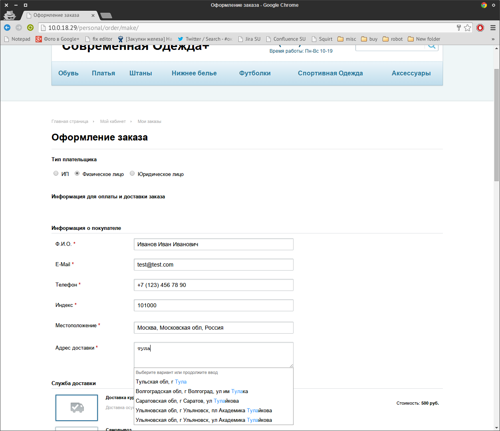

Подсказки для CMS 1C Bitrix
===========================
Версия Битрикс: 14.0 и выше.

На странице заказа в Битрикс:
- подсказываем почтовые адреса, ФИО и компании при вводе
- определяем почтовый индекс.
Используем сервис "Подсказки" [DaData.ru] (https://dadata.ru).

Работаем с компонентом современный интернет-магазин (bitrix.eshop), входящим в редакцию Битрикс "Малый Бизнес" и выше.

По [отзывам интернет-магазинов] (https://dadata.ru/#reviews-all), модуль значительно повышает качество получаемых от пользователей данных. Клиенты начинают указывать почтовые адреса для доставки, разбитые по КЛАДР, без опечаток и с квартирами, индекс определяется автоматически. ФИО вводят без опечаток и с полом.

Скриншоты
---------

Установка из MarketPlace
------------------------
В скором времени мы опубликуем наш модуль на Marketplace, и вы сможете установить его оттуда.

Установка из репозитория
------------------------

Для установки модуля из репозитория необходимо: 
* Клонировать содержимое с помощью git либо скачать слепок репозитория [отсюда] (https://github.com/hflabs/suggestions-bitrix/archive/master.zip).
* Распаковать.
* Скопировать папку dadata.suggestions в директорию bitrix/modules/ на сервере (пример ниже).

        [root@localhost ~]# git clone https://github.com/hflabs/suggestions-bitrix.git
        Initialized empty Git repository in /root/suggestions-bitrix/.git/
        remote: Counting objects: 26, done.
        remote: Compressing objects: 100% (18/18), done.
        remote: Total 26 (delta 1), reused 23 (delta 1)
        Unpacking objects: 100% (26/26), done.
        [root@localhost ~]# cp -r suggestions-bitrix/dadata.suggestions /home/bitrix/www/bitrix/modules/
        [root@localhost ~]# chown -R bitrix.bitrix /home/bitrix/www/bitrix/modules/dadata.suggestions
* Зайти в административную консоль: Вкладка "Администрирование" -> "Marketplace" -> "Установленные решения".
* В списке решений должен появиться модуль "Подсказки DaData.ru", для подключения модуля необходимо нажать на знак ≡ , в контекстном меню выбрать пункт "установить".

* После удачного завершения установки вы увидите следующий экран

Настройка модуля
----------------
* Перейдите в настройки модуля: "Настройки" -> "Настройки продукта" -> "Настройки модулей" -> "Подсказки DaData.ru"

* В поле "API Ключ" введите ключ, полученный у DaData.ru (см. инструкцию ниже).
* Далее идет список типов плательщиков и список свойств заказа для каждого. Пример назначений для стандартных свойств показан на скриншоте выше.
* Выберите для свойств заказа, в которых необходимо включить подсказки, соответствующий тип подсказок из выпадающих списков
* Стоит отметить, что для полей типа LOCATION модуль назначает значение автоматически, это сделано для того чтобы избежать конфликтов между стандартным модулем заполнения и модулем подсказок.
* После того как все необходимые настройки сделаны сохраните изменения нажав соответствующую кнопку внизу формы
* Индекс и местоположение будут заполняться автоматически, поэтому рекомендуем перенести их вниз формы. Для этого увеличьте свойство "Сортировка" в настройках свойств заказа.

Как получить API токен DaData
---------------------------
Зайдите на [DaData] (https://dadata.ru), нажмите кнопку "Попробовать бесплатно" и зарегистрируйтесь.

В правом верхнем углу нажмите кнопку профиля и выберите пункт "Настройки"

Нажмите на ссылку сгенерировать.

Скопируйте токен.

История изменений
-----------------
* 1.0.0 - Первая версия

